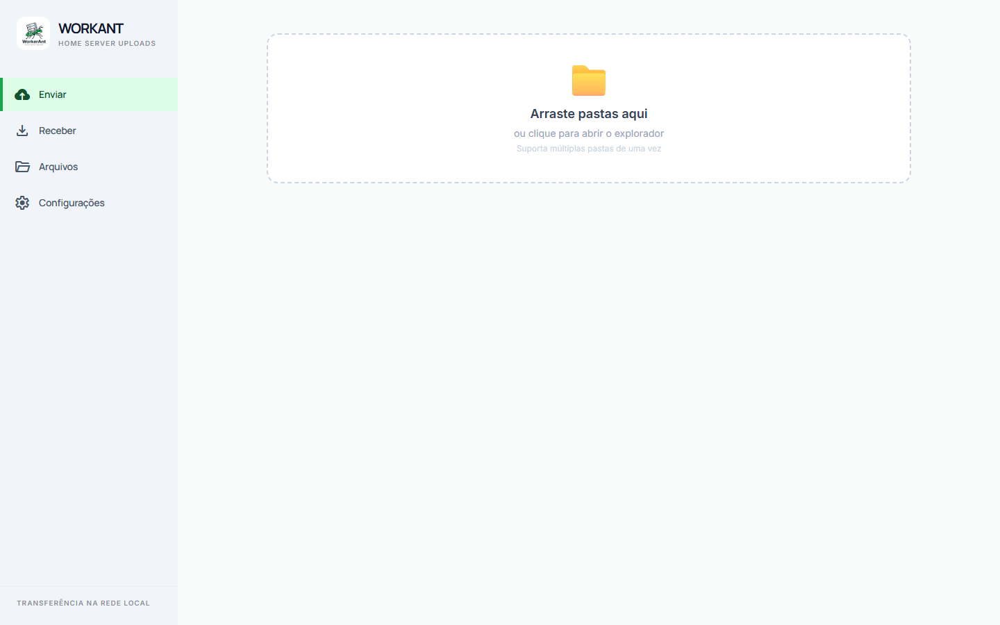
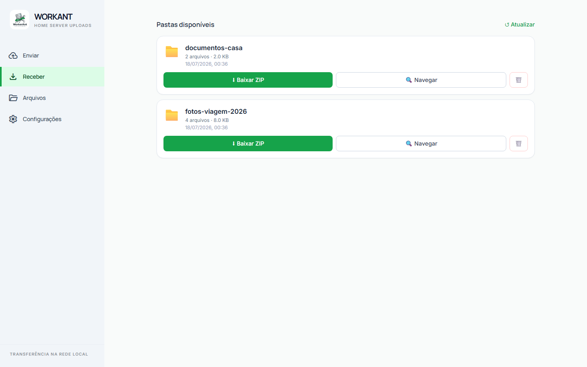
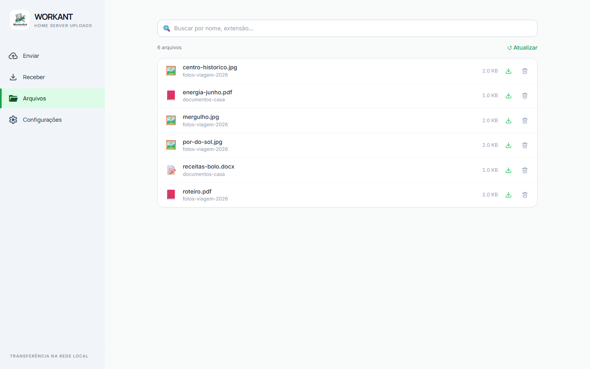
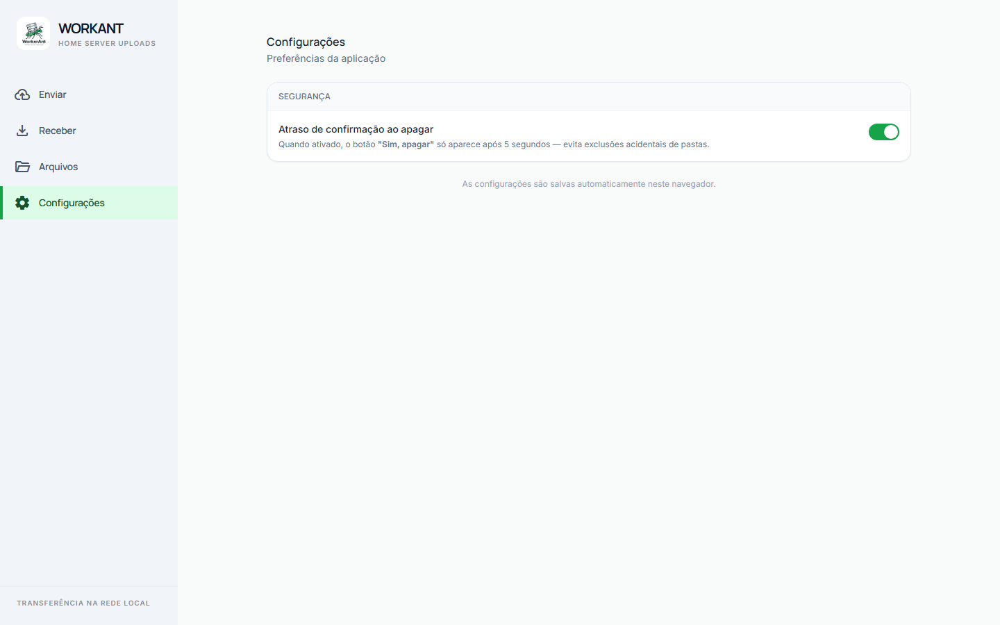
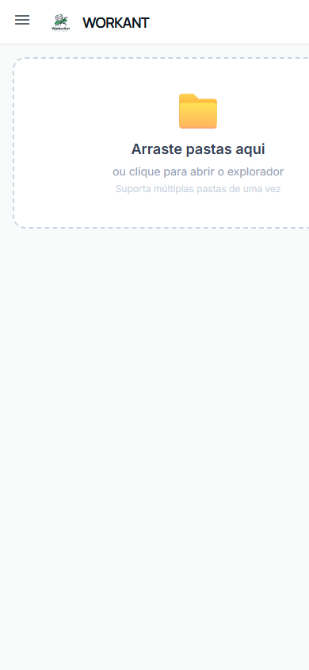

<p align="center">
  
</p>

<h1 align="center">WorkAnt</h1>

<p align="center">
  <a href="https://github.com/MatheusMarquesEiras/WorkerAnt/actions/workflows/ci.yml"></a>
</p>

<p align="center">
  Transferência de pastas inteiras entre computadores pela rede doméstica.<br>
  Sem pen drive, sem cabo, sem conta em nuvem — abre no navegador e envia.
</p>

---

## 🖼️ Demonstração

A interface segue a identidade visual do logo: verde `#00c544`, traço ink `#09151e`
e neutros frios, com fontes Manrope/Inter e Material Symbols.

| Enviar | Receber |
|---|---|
|  |  |

| Arquivos (busca global) | Configurações |
|---|---|
|  |  |

<p align="center">
  <br>
  <em>No celular, a sidebar vira menu retrátil</em>
</p>

---

## ✨ Funcionalidades

| | |
|---|---|
| 📤 **Enviar pasta** | Arraste uma pasta ou clique para selecionar — a estrutura interna é preservada |
| 📦 **Arquivos grandes** | Envio em pedaços (chunks), sem estourar memória nem limite de upload |
| 📊 **Progresso em tempo real** | Barra de progresso arquivo a arquivo durante o envio |
| 📥 **Baixar ZIP** | Compacta e baixa uma pasta inteira com um clique |
| 🔍 **Navegar arquivos** | Explorador com navegação por subpastas e breadcrumb |
| ☑️ **Download em lote** | Selecione vários arquivos e baixe tudo de uma vez |
| 🗃️ **Busca global** | Aba Arquivos: pesquisa por nome em todos os envios, com paginação |
| 🗑️ **Exclusão segura** | Apaga pastas ou arquivos individuais, com confirmação e atraso opcional contra cliques acidentais |
| ⚙️ **Configurações** | Preferências salvas no navegador (ex.: atraso de confirmação ao apagar) |
| 📱 **Responsivo** | Sidebar retrátil no celular; funciona em desktop, notebook e celular |
| 🪟 **Caminhos longos** | Contorna o limite de 260 caracteres de caminho do Windows |

---

## 🛠️ Tecnologias

**Backend** — Python · [FastAPI](https://fastapi.tiangolo.com/) · [SQLAlchemy](https://www.sqlalchemy.org/) · SQLite · [uv](https://docs.astral.sh/uv/)

**Frontend** — [React](https://react.dev/) · [Vite](https://vitejs.dev/) · TypeScript · [Tailwind CSS](https://tailwindcss.com/)

---

## 📋 Pré-requisitos

| Ferramenta | Versão mínima | Download |
|---|---|---|
| **Python** | 3.11+ | https://www.python.org/downloads/ |
| **uv** | qualquer | https://docs.astral.sh/uv/getting-started/installation/ |
| **Node.js + npm** | 18+ | https://nodejs.org/ |

> **Windows:** durante a instalação do Python, marque a opção *"Add Python to PATH"*.

---

## 🚀 Como rodar

Clone o repositório e execute um único comando:

```bash
git clone https://github.com/MatheusMarquesEiras/WorkerAnt.git
cd WorkerAnt
python start.py
```

Na primeira execução as dependências do frontend são instaladas automaticamente.
O script detecta uma porta livre para o backend e exibe os endereços de acesso
(este computador e rede local). Para parar: **Ctrl+C**.

---

## 📖 Como usar

### Aba Enviar
1. Arraste uma pasta para a área indicada **ou** clique para abrir o explorador
2. Confira o nome e a quantidade de arquivos
3. Clique em **Enviar Pasta** e acompanhe a barra de progresso

### Aba Receber
- **Baixar ZIP** — compacta e baixa a pasta inteira
- **Navegar** — explorador com subpastas, seleção múltipla e download em lote
- **Apagar** — remove um envio inteiro (com confirmação)

### Aba Arquivos
- Pesquisa por nome em **todos os envios**, com paginação
- Download ou exclusão de arquivos individuais direto do resultado

### Aba Configurações
- **Atraso de confirmação ao apagar** — o botão "Sim, apagar" só libera após
  5 segundos (proteção contra exclusão acidental)

---

## 🗂️ Estrutura do projeto

```
WorkerAnt/
├── start.py                ← inicia backend + frontend com um só comando
├── Dockerfile              ← build multi-stage (frontend + backend)
├── docker-compose.yml      ← execução com volume de dados persistente
├── .github/workflows/
│   └── ci.yml              ← CI: pytest no backend + build do frontend
├── imgs/                   ← identidade visual (logo)
│
├── backend/
│   ├── main.py             ← servidor FastAPI + criação das tabelas
│   ├── database.py         ← engine SQLAlchemy + sessão
│   ├── models.py           ← tabelas: Folder e File
│   ├── routers/            ← upload (com chunks) e download/busca/exclusão
│   └── tests/              ← pytest com banco e disco isolados por teste
│
└── frontend/
    ├── vite.config.ts      ← proxy /api → backend (porta dinâmica)
    └── src/
        ├── App.tsx          ← sidebar WorkAnt + abas Enviar/Receber/Arquivos/Config.
        ├── hooks/useSettings.ts
        └── components/      ← UploadTab, DownloadTab, FilesTab, SettingsTab
```

---

## 🧪 Testes

```bash
cd backend
uv sync
uv run pytest tests/ -v
```

A suíte cobre o ciclo completo (enviar → listar → baixar → apagar), upload em
chunks, busca com paginação e proteção contra path traversal.

---

## 🐳 Docker

Alternativa ao `start.py` — sobe tudo em um container único (modo produção):

```bash
docker compose up --build
```

Acesse em `http://localhost:8000` (ou `http://IP_DO_SERVIDOR:8000` na rede).
Arquivos enviados e banco ficam no volume `workant_data`, sobrevivendo a rebuilds.

---

## 🕘 Histórico

Este repositório é a **consolidação** do projeto: nasceu como `file-upload-server`,
evoluiu para `WorkerAnt` e ganhou uma reescrita de infraestrutura no
`pai-transferencia` — cujo backend (FastAPI + testes + Docker + CI) foi
incorporado aqui, mantendo a identidade visual do WorkAnt. Feito para resolver
um problema real: mandar arquivos de um computador pro outro dentro de casa.

## 📄 Licença

[MIT](LICENSE) — uso livre, sem garantias.
